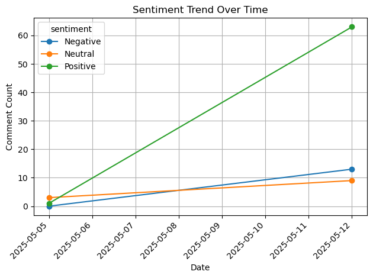
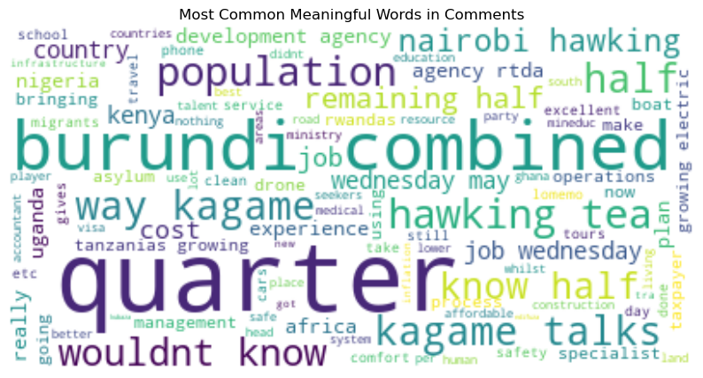
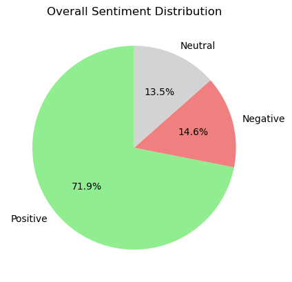

# FareReformInsights

**FareReformInsights** is a Python-based sentiment analysis dashboard that helps policymakers understand how citizens perceive Rwanda's transition to a distance-based public transport fare system.

---
## Demo
https://farereforminsights.streamlit.app/

## Features

- Visualize sentiment trends over time
- Classify feedback as Positive, Negative, or Neutral
- Generate word clouds of meaningful public terms (with improved preprocessing)
- Flag highly emotional (subjective) comments
- Filter by date and explore sample real-world comments
- Retrieve and analyze tweets via Twitter API
- Export and work with extended datasets

---

## Project Structure

```
FareReformInsights/
├── analysis/
    ├── sentiment_analysis.py
├── data/
│   ├── expanded_tweets.csv
├── app.py
├── datasource.ipynb
├── requirements.txt
└── README.md
```

---

## Installation

```bash
git clone https://github.com/<abmuvunyi>/FareReformInsights.git
cd FareReformInsights
pip install -r requirements.txt
```

---

## Running the Streamlit App

```bash
streamlit run app.py
```

---

## Screenshots

_Below are some of the screenshots

```markdown
### Sentiment Trend Chart


### Word Cloud (Cleaned)


### Flagged Comments

```

---

## Data Sources

- Real tweets collected via Twitter API using keyword-based search (e.g., `"public transport" Rwanda`)
- we started using Simulated public comments from X.com
- Optional: Google Forms survey data

---

## Authors & Acknowledgments

Developed by **Ab Muvunyi** for the **Tech Associates Hackathon**  
Powered by Python, TextBlob, Streamlit, and Twitter API v2

